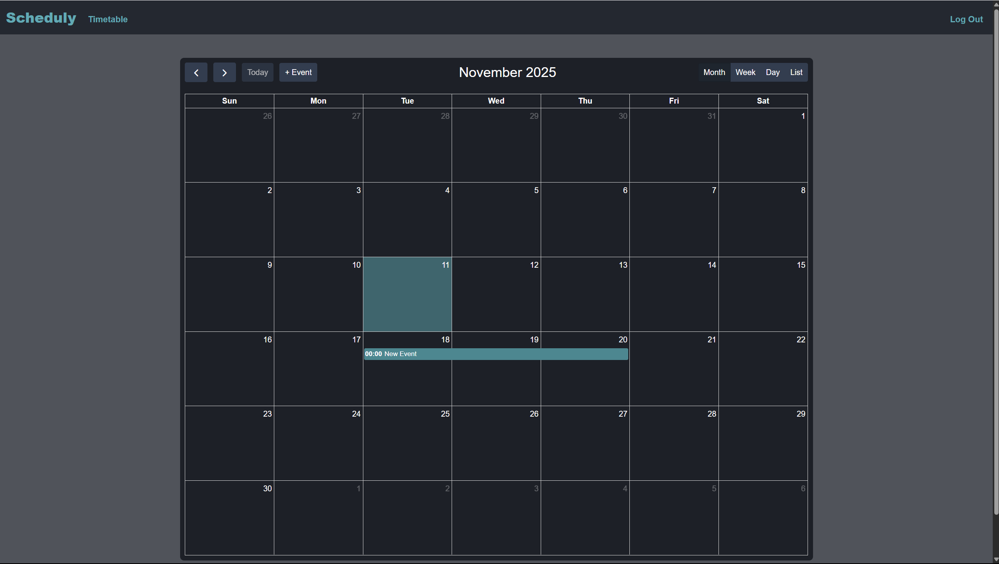

# Scheduly

### **Github:** [Repository](https://github.com/Dragontand/Final-project)

### Video Demo: `<PLAK HIER JE VIDEO URL>`

## Description

Scheduly is a web-based personal scheduling assistant designed to help users manage their time effectively. It allows users to create accounts, log in, and maintain a personal calendar where they can add, edit, and delete events. The project utilizes Flask for the backend framework, a SQLite database for data storage, a Bootstrap Datepicker (with custom CSS), and integrates the FullCalendar JavaScript library to provide an interactive and intuitive user interface.



---

## How to Run This Project

To run this project locally, follow these steps:

1. **Clone the repository** **or download the source code.**
2. **Set up a virtual environment:**

   ```bash
   python -m venv .venv
   ```
3. **Activate the environment:**

   * Windows (PowerShell): `.\.venv\Scripts\Activate.ps1`
   * macOS/Linux: `source .venv/bin/activate`
4. **Install dependencies:**

   ```bash
   pip install -r requirements.txt
   ```
5. **Run the application:**

   ```bash
   flask run
   ```

   The application will be available at `http://127.0.0.1:5000`.

---

## Project Structure and File Descriptions

The project is organized into a clear structure separating backend logic, templates, and static assets.

### Backend Core

* **`app.py`**: This is the main application file. It initializes the Flask app, configures the session (filesystem-based), and establishes the connection to the SQLite database. It contains all the route definitions and handles all server-side logic and most of the error handling:
  * **Authentication routes** (`/login`, `/logout`, `/register`, `/register/new`) handle user access, validating credentials and returning JSON responses.
  * **Main-page routes** (`/`, `/timetable`) render the core user interface.
  * **API-style routes** (`/events` [GET], `/events/new` [POST], `/events/edit/<id>` [POST], `/events/delete/<id>` [DELETE]) are used by the frontend JavaScript. These routes communicate purely via JSON to perform CRUD (Create, Read, Update, Delete) operations asynchronously.
* **`scheduly.db`**: A SQLite database that stores user information (hashed passwords for security) and their associated events (titles, descriptions, start/end dates). It includes an index (`idx_events_user`) for fast `SELECT` results between users and events, and a `categories` table for future expansion.
* **`requirements.txt`**: Lists all the Python dependencies required to run the application (Flask, Flask-Session), ensuring reproducibility of the environment.

### Templates (HTML)

The user interface is built using Jinja2 templating.

* **`layout.html`**: The base template that defines the common structure of every page (navigation bar, flash message container, main, etc.). Crucially, it also contains the generic Bootstrap Modal structure used for both creating and editing events. Placing this in the layout avoids duplicating HTML code on multiple pages.
* **`index.html`**: The landing page that welcomes users to the application.
* **`login.html` & `register.html`**: Simple forms for user authentication.
* **`timetable.html`**: The core application view. It contains the placeholder `<div>` where FullCalendar renders the interactive calendar/timetable.

### Static Assets (CSS & JS)

* **`calendar.js`**: This script initializes FullCalendar. It defines the event source (`events: "/events"`), adds the custom "+ Event" button, and handles the `eventClick` listener to open the modal for editing. It imports all its event-handling logic from `modal.js`.
* **`login.js` & `register.js`**: These files handle the `fetch` logic for the login and registration forms, sending data to the backend and showing errors via `showFlash` without a page reload.
* **`modal.js`**: This is the logistic heart of the application. It manages all behavior of the event modal, including:
  * The clickable title (switching between text and an input field).
  * Exporting functions like `fillModalForEdit`, `setupModalForCreate`, and `setupModalForUD` (Update/Delete).
  * Handling all C/U/D (Create/Update/Delete) `fetch` logic inside the setup functions, including showing errors or success messages.
* **`flash.js`**: A separate utility module that exports the `showFlash` function. This function dynamically creates client-side Bootstrap alerts.
* **`global.css`**: Defines CSS variables (custom properties) for uniform coloring and spacing across the entire application, making it easy to change the theme.
* **`styles.css`**: Contains general styling for typical HTML elements, the navigation bar, and forms.
* **`timetable-styles.css`**: Specifically targets and overrides FullCalendar's & Bootstrap Datepicker's default styles to match Scheduly's dark theme and custom color scheme.

---

## Design Choices

### Bootstrap

* **Bootstrap:** The first significant design choice I made was to use **[Bootstrap](https://getbootstrap.com/)**. I had learned about it at my IT school beforehand. Then, CS50 showed it to me again, and I decided to use it for this project because it abstracts away a lot of complex CSS and JavaScript. It provides a beautiful and handy system that makes it easy to brighten up a website/web-application.
* **Modal:** The next significant design choice was to use a **single, reusable Bootstrap modal** for both creating new events and editing existing ones. Instead of creating two separate HTML structures, I chose to dynamically update the modal's content (title, button text, and event listeners) using JavaScript (`modal.js` and `calendar.js`). This reduced code duplication in `layout.html` and kept the frontend much cleaner.
* **Bootstrap Datepicker:** This design choice is less significant but still deserves a spot here. I decided to use a [Bootstrap Datepicker](https://github.com/uxsolutions/bootstrap-datepicker/tree/master). It makes picking a date a breeze and, as I did, can be used in tandem (with a start and end date) so that making or editing an event is simple and intuitive.

### AJAX (Asynchronous JavaScript and XML)

A fundamental design choice was adopting **AJAX-style communication** for *all* user interactions. While the initial page (`GET`) loads via standard Flask rendering, all C/U/D operations (creating, editing, deleting events) and user authentication (logging in, registering) are handled via JavaScript `fetch` calls. This provides a much smoother, "app-like" experience for the user, as the calendar updates or errors appear immediately without needing a full page refresh. This required more JavaScript, but the logic was straightforward.

### SQLite

For the database, **SQLite** was chosen for its simplicity and ease of setup, which is ideal for a project of this scale. It requires no separate server process and stores the entire database in a single file (`scheduly.db`), making the project very portable.

---

## Limitations & Future Features

* **Categories:** The `categories` table already exists in the database, but the functionality is not yet implemented in the interface. A future feature would be to add a dropdown in the modal, allowing users to select and manage their own categories (e.g., 'Work', 'Personal', 'Sport').
* **Time Selection:** Currently, the app only saves dates as "all-day" events. A major improvement would be to add time selection to the datepicker, allowing users to input specific start and end times for their events.
* **CSS Structure:** The base CSS is straightforward, but integrating third-party libraries like FullCalendar and Bootstrap Datepicker required significant style overrides in `timetable-styles.css`. In the future, these overrides could be refactored and streamlined to better align with Scheduly's clean and structured design.
